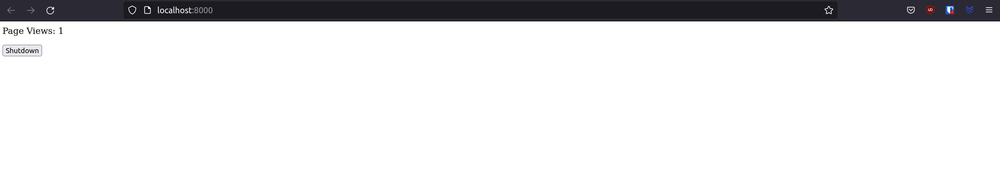

# Easy C# HTTP Server

This Project contains an easy C# http Server [Reference to Benjamin N. Summerton](https://gist.github.com/define-private-public/d05bc52dd0bed1c4699d49e2737e80e7). This service only counts visits and provide a "shutdown" button. Code is only in Program.cs.

# HowTo local
1. Open Terminal 
2. use cd to change to the folder containing this project 
>`cd Path/To/Folder`
3. use Dotnet CLI to run Project 
> `dotnet run`
4. You should get message : 
> Listening for connections on http://localhost:8000/
5. Open Browser and navigate to http://localhost:8000/

# HowTo docker
1. Open Terminal 
2. use cd to change to the folder containing this project 
>`cd Path/To/Folder`
3. use docker build to build the image in place 
> `docker build -plainhttp -f Dockerfile/Dockerfile .`
4. Use docker run to run the image. Forward containerPort 8000 to hostport 8000.
> `docker run -p 8000:8000 plainhttp
4. You should get message : 
> Listening for connections on http://localhost:8000/
5. Open Browser and navigate to http://localhost:8000/

## Website

